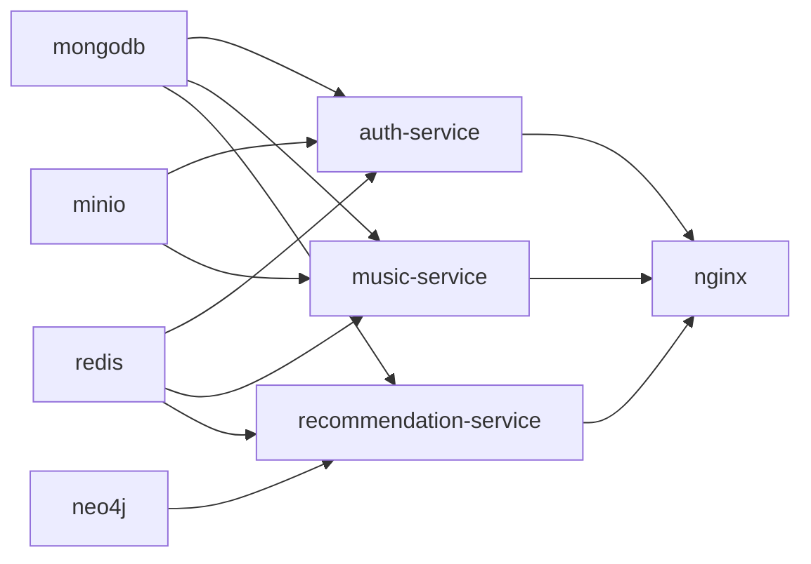

# KornBeat Services Documentation

## Overview
Complete documentation of all microservices and infrastructure components in the KornBeat music streaming platform.

---

## 🏗️ Infrastructure Services

### MongoDB (Port 27017)
- **Purpose**: Primary database for user data, music metadata, playlists, and application state
- **Database**: `music_app`
- **Credentials**: `admin/admin123` (root), `music_user/music_pass` (application)
- **Initialization**: Runs `init.js` script on startup
- **Health Check**: MongoDB ping command every 30s

### Neo4j (Ports 7474/7687)
- **Purpose**: Graph database for personalized recommendations and relationship analysis
- **Credentials**: `neo4j/neo4j_password`
- **Plugins**: APOC, Graph Data Science
- **Memory Configuration**: 512M initial heap, 2G max heap, 1G page cache
- **Browser Interface**: http://localhost:7474

### Redis (Port 6379)
- **Purpose**: Caching, session storage, rate limiting, and temporary data
- **Password**: `redis_password`
- **Configuration**: Custom `redis.conf` file
- **Databases**: Multiple databases for different purposes (sessions, cache, etc.)

### MinIO (Ports 9000/9001)
- **Purpose**: S3-compatible object storage for MP3 files and cover art
- **Credentials**: `minioadmin/minioadmin`
- **Console**: http://localhost:9001
- **API**: http://localhost:9000

---

## 🔐 Auth Service (Port 3001)

### Purpose
Handles user authentication, registration, JWT token management, and session persistence across the platform.

### Configuration
- **Environment**: Production mode
- **JWT Settings**: 15-minute access tokens, 7-day refresh tokens
- **Dependencies**: MongoDB, Redis, MinIO

### Key Features
- User registration with email validation
- Secure password hashing with bcrypt
- JWT-based stateless authentication
- Redis session management with TTL
- Rate limiting for registration and login attempts

### Health Check
- Endpoint: `http://localhost:3001/health`
- Interval: Every 30 seconds

---

## 🎵 Music Service (Port 3002)

### Purpose
Core music management service handling catalog operations, audio streaming, playlists, favorites, and search functionality.

### Configuration
- **Environment**: Production mode
- **Dependencies**: MongoDB, Redis, MinIO
- **External API**: Configurable external music API integration

### Core Features
- **Music Import**: `importMusic.js` script for metadata extraction
- **Audio Streaming**: Range request support for seeking and progressive playback
- **Search System**: Artist, song title, and genre/category search with regex queries
- **Playlist Management**: Full CRUD operations with atomic updates
- **Favorites System**: Like/unlike functionality with counters
- **Cover Art Processing**: Dynamic URL generation for MinIO-stored images

### Technology Stack
- **Framework**: Express.js with CORS support
- **Dependencies**: MongoDB via Mongoose, Redis client, MinIO SDK, music-metadata library

### Health Check
- Endpoint: `http://localhost:3002/health`
- Interval: Every 30 seconds

---

## 🤖 Recommendation Service (Port 3003)

### Purpose
Graph-based recommendation engine providing personalized music suggestions using Neo4j for relationship analysis and MongoDB for user data synchronization.

### Configuration
- **Environment**: Production mode
- **Neo4j Connection**: Bolt protocol to port 7687
- **Sync Settings**: 30-minute intervals, 30-day history retention
- **Dependencies**: MongoDB, Neo4j, Redis

### Recommendation Algorithms
- **Personalized**: Genre-based analysis of user listening history
- **Global Rankings**: Most played songs worldwide
- **Collaborative Filtering**: Users with similar taste patterns
- **Trending**: Recent momentum analysis (7-day window) 
- **Genre-based**: Multi-genre matching with scoring

### Data Synchronization
- **Sync Service**: `sync-service.js` handles MongoDB → Neo4j data transfer
- **Collections**: Users, songs, artists, genres, play history, likes, follows
- **Field Mapping**: Configurable schema translation between databases

### Caching Strategy
- **Redis TTL**: 5 minutes for recommendation results
- **Cache Keys**: Parameter-based cache invalidation

### Health Check
- Endpoint: `http://localhost:3003/health`
- Interval: Every 30 seconds

---

## 🌐 Nginx Reverse Proxy (Port 80)

### Purpose
Load balancer and reverse proxy providing unified entry point for all services and static file serving.

### Configuration
- **Container Name**: `auth_nginx`
- **Dependencies**: Starts after all application services are healthy
- **Health Check**: HTTP endpoint verification

---

## 📊 Service Dependencies

---

## 🚀 Service Startup Order

1. **Infrastructure Services** (with health checks):
   - MongoDB (30s start period)
   - Redis (10s start period)
   - MinIO (10s start period)
   - Neo4j (40s start period)

2. **Application Services** (wait for infrastructure health):
   - Auth Service (20s start period)
   - Music Service (20s start period)
   - Recommendation Service (40s start period)

3. **Nginx** (starts after all applications are healthy)

---

## 📝 Environment Variables

### Common Variables
- `NODE_ENV=production` - Production mode for all services
- `MONGODB_URI` - MongoDB connection string
- `REDIS_HOST/PORT/PASSWORD` - Redis connection settings
- `JWT_SECRET` - JWT token signing key

### Service-Specific Variables
- **Auth Service**: `JWT_EXPIRES_IN=15m`, `REFRESH_TOKEN_EXPIRES_IN=7d`
- **Music Service**: `EXTERNAL_API_URL/KEY`, `MINIO_ENDPOINT/PORT`
- **Recommendation Service**: `NEO4J_URI/USER/PASSWORD`, `SYNC_INTERVAL_MINUTES=30`

---

## 🛠️ Development vs Production

### Development Mode
- Services run natively with `npm run dev` for hot-reload
- Infrastructure runs in Docker
- Frontend on port 3000, services on individual ports

### Production Mode
- All services run in Docker containers
- Single entry point through Nginx on port 80
- Health checks and automatic restarts enabled
- Optimized builds and security configurations

## Notes

All services implement comprehensive health checks and use Docker's health-check dependencies to ensure proper startup order. The recommendation service includes a data synchronization mechanism that runs every 30 minutes to keep Neo4j updated with MongoDB changes. Each service is containerized with multi-stage Docker builds for production optimization.
